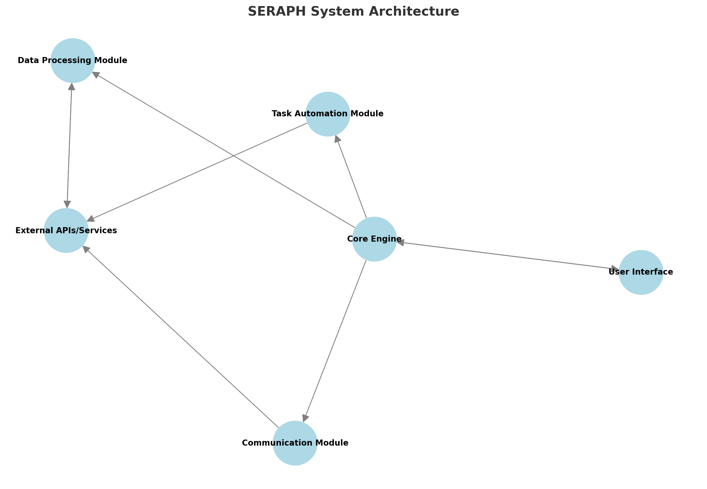

# Project: **SERAPH**

![Project: SERAPH][logo]

[![License: Private][license-badge]][license-link]
[![Contributors: 1][contributors-badge]][contributors-link]
[![Contribute Now!][contribute-now-badge]][contribute-now-link]

![Status: In Progress][status-badge]
[![Roadmap][roadmap-badge]][roadmap-link]
[![Changelog][changelog-badge]][changelog-link]

---

[logo]: assets/SERAPH_logo_1024_no_bg.png  
[license-badge]: https://img.shields.io/badge/License-Private-red.svg  
[license-link]: docs/legal/LICENSE  
[contributors-badge]: https://img.shields.io/badge/Contributors-1-blue.svg  
[contributors-link]: .github/CONTRIBUTORS.md
[contribute-now-badge]: https://img.shields.io/badge/Contribute-Now-green.svg
[contribute-now-link]: .github/CONTRIBUTING.md
[status-badge]: https://img.shields.io/badge/Status-In%20Progress-blue.svg  
[roadmap-badge]: https://img.shields.io/badge/Roadmap-View%20Details-blue.svg  
[roadmap-link]: docs/ROADMAP.md  
[changelog-badge]: https://img.shields.io/badge/CHANGELOG-View%20Details-blue.svg  
[changelog-link]: docs/CHANGELOG.md  

Below is the breakdown of the acronym "SERAPH":

- **S**: Scalable: The system should be able to scale up or down based on the user's needs.
- **E**: Engine: The core of the system that drives all functionalities.
- **R**: Responsive: The system should respond quickly to user inputs and external events.
- **A**: Automation: The system should automate repetitive tasks to save time and effort.
- **P**: Processing: The system should efficiently process data and information.
- **H**: Harmony: The system should work in harmony with the user's workflow.

---

## Table of Contents

- [Project: **SERAPH**](#project-seraph)
  - [Table of Contents](#table-of-contents)
  - [Description](#description)
  - [Progress Overview](#progress-overview)
  - [System Architecture](#system-architecture)
  - [Design Ideas](#design-ideas)
    - [Core Features](#core-features)
      - [Robust Logging](#robust-logging)
      - [Error and Crash Handling](#error-and-crash-handling)
      - [Resource Management](#resource-management)
      - [Connection Recovery](#connection-recovery)
      - [System Monitoring](#system-monitoring)
    - [Modules](#modules)
      - [Communication Module](#communication-module)
        - [SMS Management](#sms-management)
        - [Email Integration](#email-integration)
        - [Voice Calling](#voice-calling)
      - [Task Automation Module](#task-automation-module)
        - [Reminder System](#reminder-system)
        - [Recurring Task Scheduler](#recurring-task-scheduler)
        - [Priority-Based Organization](#priority-based-organization)
      - [Data Processing Module](#data-processing-module)
        - [Data Parsing](#data-parsing)
        - [API Data Fetching](#api-data-fetching)
        - [Custom Data Formats](#custom-data-formats)
    - [Expansion Ideas](#expansion-ideas)
  - [References](#references)
  - [Legal Information](#legal-information)
    - [License](#license)
    - [Contact](#contact)
    - [Acknowledgements](#acknowledgements)
  - [Additional Information](#additional-information)
    - [Roadmap](#roadmap)
    - [CHANGELOG](#changelog)

---

## Description

**SERAPH** is a private, intelligent assistant designed to support a small, trusted user base in daily activities. It is built with a focus on stability, adaptability, and lightweight efficiency, suitable for personal or small-team use. Its modular design allows for detailed customization and functionality expansion based on specific user requirements.

SERAPH prioritizes features like robust error handling, resource management, and seamless reconnection to ensure uninterrupted performance. Designed for personal efficiency, it integrates advanced tools for task automation, communication, and data processing.

---

## Progress Overview

- Core Features: **0/5 (0%)** ![Status: In Progress][status-badge-core]
- Modules: **0/3 (0%)** ![Status: Pending][status-badge-modules]
- Expansion Ideas: **0/3 (0%)** ![Status: Pending][status-badge-expansion]
- Total: **0/11 (0%)**

[status-badge-core]: https://img.shields.io/badge/Status-In%20Progress-blue.svg  
[status-badge-modules]: https://img.shields.io/badge/Status-Pending-lightgrey.svg  
[status-badge-expansion]: https://img.shields.io/badge/Status-Pending-lightgrey.svg  

---

## System Architecture

Below is a visual representation of the architecture for **SERAPH**:

The architecture consists of interconnected modules for communication, task automation, and data processing. Each module interacts with the Core Engine, which manages logging, resource allocation, and connection handling.

---

## Design Ideas

The following sections outline the core features, modules, and potential expansion ideas for SERAPH. These concepts serve as a foundation for development and customization based on user needs. This is a living document that will evolve as the project progresses. Please refer to the [ROADMAP.md](docs/ROADMAP.md ) file for detailed development milestones and the [CHANGELOG.md](docs/CHANGELOG.md) file for updates and revisions.

---

### Core Features

- **Customization Options**: Each feature includes configurable settings, such as logging levels, alert types (SMS, email, push), and recovery thresholds for system resources.

---

#### Robust Logging

- **Description**: Maintains detailed logs of all interactions, processes, and errors.
- **Use Case**: Enables troubleshooting by recording granular details about system performance and user inputs.

#### Error and Crash Handling

- **Description**: Captures and resolves errors, preventing crashes from disrupting workflows.
- **Use Case**: Implements fallback procedures and self-healing mechanisms to maintain functionality after failures.

#### Resource Management

- **Description**: Optimizes CPU, RAM, and network usage for seamless multitasking.
- **Use Case**: Dynamically allocates resources to active processes while maintaining system efficiency.

#### Connection Recovery

- **Description**: Automatically detects and reconnects upon network loss or API timeouts.
- **Use Case**: Ensures continuous operation in unstable network environments.

#### System Monitoring

- **Description**: Provides insights into resource usage, system health, and ongoing processes.
- **Use Case**: Alerts users to performance bottlenecks and logs metrics for later analysis.

---

### Modules

#### Communication Module

##### SMS Management

- **Description**: Handles SMS sending, receiving, and organizing.
- **Use Case**: Automates sending reminders or alerts via SMS to specified contacts.

##### Email Integration

- **Description**: Connects with email clients for reading, sorting, and composing messages.
- **Use Case**: Syncs with user-defined accounts to manage communications efficiently.

##### Voice Calling

- **Description**: Manages and facilitates voice calls, including call logs and recording.
- **Use Case**: Allows quick initiation of calls directly from the assistant’s interface.

---

#### Task Automation Module

##### Reminder System

- **Description**: Sets and manages one-time or recurring reminders.
- **Use Case**: Notifies users about deadlines or scheduled events.

##### Recurring Task Scheduler

- **Description**: Automates repetitive tasks with customizable intervals.
- **Use Case**: Reduces manual input for tasks like weekly reports or daily check-ins.

##### Priority-Based Organization

- **Description**: Sorts tasks by priority and urgency.
- **Use Case**: Highlights critical tasks to ensure timely completion.

---

#### Data Processing Module

##### Data Parsing

- **Description**: Extracts and formats data from user inputs or external sources.
- **Use Case**: Converts unstructured data into actionable formats.

##### API Data Fetching

- **Description**: Connects to APIs for retrieving relevant information (e.g., weather, news).
- **Use Case**: Pulls real-time data to enrich responses and outputs.

##### Custom Data Formats

- **Description**: Supports non-standard data structures specific to user needs.
- **Use Case**: Processes unique data inputs for niche applications.

---

### Expansion Ideas

- **Multi-Device Synchronization**: Synchronize data and activities across multiple devices for seamless access.
- **Custom Workflow Automation**: Define and execute workflows, e.g., "If meeting ends, send a summary email."
- **Contextual AI Insights**: Provide task suggestions or reminders based on user activity and historical data.
- **Voice Recognition Integration**: Add a voice interface for hands-free operation.
- **Encrypted Data Handling**: Secure sensitive data with end-to-end encryption.
- **Advanced System Profiling**: Enable dynamic system adjustments based on usage patterns.

---

## References

- Python Libraries: `Flask`, `FastAPI`, `Pandas`, `NumPy`, `Requests`, `CUDA`, `Dataset`, `Matplotlib`, `Seaborn`, `Scikit-learn`, `accelerate`, `Pillow`, `Scrapy`, `BeautifulSoup`
- NLP Models: `spaCy`, `Hugging Face Transformers`, `DistilBERT`
- APIs: Twilio (SMS), OpenWeather (Weather data)
- [RFC 5322 - Internet Message Format](https://datatracker.ietf.org/doc/html/rfc5322)
- [Twilio API Documentation](https://www.twilio.com/docs/usage/api)
- [OpenWeather API Documentation](https://openweathermap.org/api)
- [Flask Documentation](https://flask.palletsprojects.com/en/2.0.x/)

---

## Legal Information

### License

This project is licensed under a **Private License**. For details, refer to the [LICENSE](docs/legal/LICENSE) file.

### Contact

For internal communication regarding SERAPH, contact the project owner directly.

- For bug reports, feature requests, or general feedback, please open an issue on the GitHub repository.
- For security concerns or sensitive matters, contact the project owner via [Email](mailto:ncacord@protonmail.com)
- For legal inquiries, refer to the [LICENSE](docs/legal/LICENSE) file for details on usage and distribution rights.
- For additional information, refer to the [CONTRIBUTING.md](.github/CONTRIBUTING.md) file for guidelines on contributing to the project.

### Acknowledgements

Acknowledgment goes to trusted contributors and open-source libraries leveraged for development.

---

## Additional Information

### Roadmap

All development milestones are documented in the [ROADMAP.md](docs/ROADMAP.md ) file, accessible to contributors.

### CHANGELOG

All updates and revisions are detailed in the [CHANGELOG.md](docs/CHANGELOG.md) file for internal tracking.

---

*Contributors may be required to sign a Non-Disclosure Agreement (NDA) and/or a Contributor License Agreement (CLA) prior to contributing to the project. Please refer to [CODE_OF_CONDUCT.md](.github/CODE_OF_CONDUCT.md) for guidelines on participation and behavior expectations then, [CONTRIBUTING.md](.github/CONTRIBUTING.md) to get started.*
